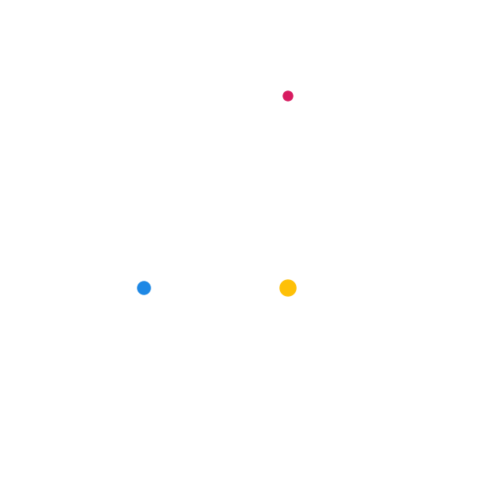

# Python Animation Tutorial

Some basic shape manipulations in Python.

## Table of Contents

[[_TOC_]]

## Overview
This repo contains some basic Python animations. Although Python is mostly considered to be a high level scripting language, it can be useful for quickly visualizing and building intuition on new ideas. For more advanced simulations, the reader might consider a domain specific framework, such as [ROS](https://www.ros.org/), providing a feature-full robotics suite. However, these platforms often come with significant overhead, and can be time consuming to get up and running. The following scripts will demonstrate how easy it is to get started, which is what makes Python animations so awesome.

## Installation

You will need a basic installation of [Python3](https://www.python.org/downloads/) on your computer. Most of the scripts in this repo will require `matplotlib` and `numpy`. Optionally, you might want to install `scipy` for more advanced simulations using an ODE solver. The easiest way to install these packages is using [pip](https://pip.pypa.io/en/stable/installing/):

```
pip install matplotlib numpy scipy
```

If you prefer to use Python in an isolated workspace, checkout [Pipenv & Virtual Environments](https://docs.python-guide.org/dev/virtualenvs/). For a complete overview of the official best practices for package management, see the [Python Packaging User Guide](https://packaging.python.org/).

## Usage

Clone this repo somewhere onto your machine:

```
git clone https://git.uwaterloo.ca/autonomous-systems-lab/python-animation-tutorial.git
```

After installing the required libraries, execute the Python script of your choice from the `src` directory.

## Code Description

### Structure

There are many approaches we could take to generate an animation. For simplicity, we will separate the simulation from the animation. The scripts in this repo have the following structure:

1. Simulation:
	1. Initialize the parameters
	2. Simulate some dynamics and keep track of the values at each timestep
2. Animation:
	1. Initialize the plot
	2. Add patches to the plot
	3. Update the patches at each timestep using the simulation data
3. Play the animation and optionally save it to a local file

### Simulation Approach

There are many Python libraries we could choose from to generate our simulation data. Since this repo will focus on animations, we will not go into detail here. The first couple demonstrations have simple dynamics, so we will use the Euler integration method. However, to simulate more interesting dynamics, we will use a more advanced ODE solver from the `scipy` library. ODE solvers will often allow for higher precision solutions. Although this is useful for simulation, we will often want to downsample from the solution to get our animation data. Otherwise, we would be attempting to animate a frame rate much higher than what is noticeable to the human eye. Depending on the timestep of the ODE solver, we should downsample to a more reasonable frame rate (10 to 50 fps). Doing so allows us to visualize advanced simulations without the need for overkill animations.

### Animation Approach

To make an animation, we will first create a shape and then perform transformations on that shape at fixed timesteps. In Python, this can be accomplished by manipulating [patches](https://matplotlib.org/3.3.3/api/patches_api.html) from the `matplotlib` library. This module provides many useful subclasses, which will help us create and manipulate various shapes. We are not only limited to these patches. In fact, we can incorporate many `matplotlib.pyplot` [functions](https://matplotlib.org/3.1.1/api/_as_gen/matplotlib.pyplot.html) into our animations. This is especially useful for animating scatter plots, bar charts, quivers etc.

More specifically, we will make use of the [FuncAnimation](https://matplotlib.org/3.1.1/api/_as_gen/matplotlib.animation.FuncAnimation.html) class from the `matplotlib.animation` module. This class creates an animation by repeatedly calling the `animation` function. In this function, we have access to the frame index `i`, which gets incremented after every call. We will use this index to choose values from our simulations data and perform transformations on the patches. It is important to remember to return the updated objects at the end of this function, otherwise, their values will remain unchanged.

To view the animation, we make a call to `plt.show()`. This allows us to directly play the animation when executing the script. However, for more complex animations, there could be noticeable lag and dropped frames. For higher resolution visuals, we are better off saving the animation to a local file and playing it through an external player. Each script contains a commented `ani.save()` command to demonstrate the general syntax.

*Note: To remove the axes and whitespace padding around the figure, we can add the following to our script:*

```python
ax.axis('off')
fig.subplots_adjust(left=0, right=1, bottom=0, top=1)
```

*Note: When instantiating the `FuncAnimation` class, we will set the optional parameter `blit=True`. This will improve performance by only updating patches that have changed in the figure. By setting this parameter to `True`, `FuncAnimation` expects an iterable list of artists to be returned by `animation`.*

## Scripts

Here we give a brief description alongside a gif to illustrate the functionality of each script contained in this repo. They are organized to start with some of the more basic concepts. Once we know how to animate translations and rotations, we can combine these to make fairly complex looking visualizations.

### Circle Scaling


This [script](src/circle_scaling.py) creates an animation for a circle being scaled up and down, fixed at the origin.

### Circle Translation


This [script](src/circle_translation.py) creates an animation for a circle being translated along the x axis.

### Polygon Rotation


This [script](src/polygon_rotation.py) creates an animation for a rotating square. Notice the script uses the `Polygon` class as opposed to the seemingly simpler `Rectangle` class. This allows us to update the coordinates using a rotation matrix on the shape's base coordinates. We can then use this same approach to rotate any polygon we wish to create.

### Multiple Patches


Animating multiple patches is quite simple. Since our implementation of `FuncAnimation` already expects an iterable return value, we can simply return a list of all the patches we wish to animate. We just have to remember to first add all the patches to the axis. In the `animate` function, note that we no longer need a trailing `,` on the return value. This was only necessary when returning a single object (not an iterable).

This [script](src/three_body.py) creates an animation for the [three-body problem](https://en.wikipedia.org/wiki/Three-body_problem). Since we are dealing with more complex dynamics, we will solve the system of differential equations using [scipy.integrate.solve_ivp](https://docs.scipy.org/doc/scipy/reference/generated/scipy.integrate.solve_ivp.html#scipy.integrate.solve_ivp). This only changes how we gather our simulation data. The animation procedure remains the same, where we sequentially update the patches' coordinates.

### Vectors


In this [script](src/vectors.py), we add vectors to our animation from above. The arrows represent the resulting gravitational force between the interacting bodies. Animating vectors is a great way to gain intuition on physical quantities during a simulation. The simulation portion of the script remains the same since the acceleration values were already in the ODE solver's solution.

Unfortunately, the [FancyArrow](https://matplotlib.org/3.1.1/api/_as_gen/matplotlib.patches.FancyArrow.html) patch does not allow us to update its coordinates. To use this patch, we would first have to clear them from the axis, and add new ones. Instead, we will use the `pyplot` [quiver](https://matplotlib.org/3.1.1/api/_as_gen/matplotlib.pyplot.quiver.html) object. A `quiver` defines a 2D vector field, and will allow us to iteratively update the arrows' coordinates in our animation function. Although this is a `pyplot` object, the steps are similar to our animations with patches. We first create the quiver object, and then update its coordinates before returning it in the animation function. Furthermore, the quiver object can easily be combined with our `Cirlce` patches by concatenating the lists in the return value.

*Note: Since we now have multiple patches to update, this scripts employs Python's `zip()` function. This simplifies our code and allows us to [iterate through multiple lists](https://realpython.com/python-zip-function/#looping-over-multiple-iterables) in parallel.*

### Trajectories



It can also be useful to visualize trajectories during an animation. This [script](src/trajectories.py) demonstrates how to make trajectories with the `Polygon` patch we previously used. In this case, since the endpoints are not connected, we will set the parameters `closed=False, filled=False` when creating the patch. This will produce what appears to be line segments, as opposed to a filled patch.

Looking at the three-body problem again, we only need the position values from the ODE solution to plot the trajectories. The simulation portion of the script therefore remains the same.

### Partial Trajectories

Instead of setting the trajectories to all simulation points from the start, we can easily create a receding interval. In this [script](src/partial_trajectories.py), the only difference from the previous animation is the line which updates the trajectories. In the animation function, the index specifying the lower bound of our position array is set using a fixed offset from the frame index. This allows us to visualize trajectories without overcrowding the figure.


## TODO

- [ ] Animation involving positions and heading to demonstrate how to combine translations and rotations

## Contributing

If you feel the need to demonstrate additional animation functionalities, make a merge request and add a short description and video to the [README](README.md). Here is an example showing how to save a gif of your animation from the Python script:

```python
from matplotlib.animation import FFMpegWriter
from matplotlib.animation import FuncAnimation
dt = 0.02 # Simulation timestep required for a 50 fps gif
ani = FuncAnimation(...)
ani.save('path/to/save/animation.gif', writer=FFMpegWriter(fps=int(1/dt)))
```

Please open an issue for installation issues, bugs found in the scripts or any suggestions for future improvements.
